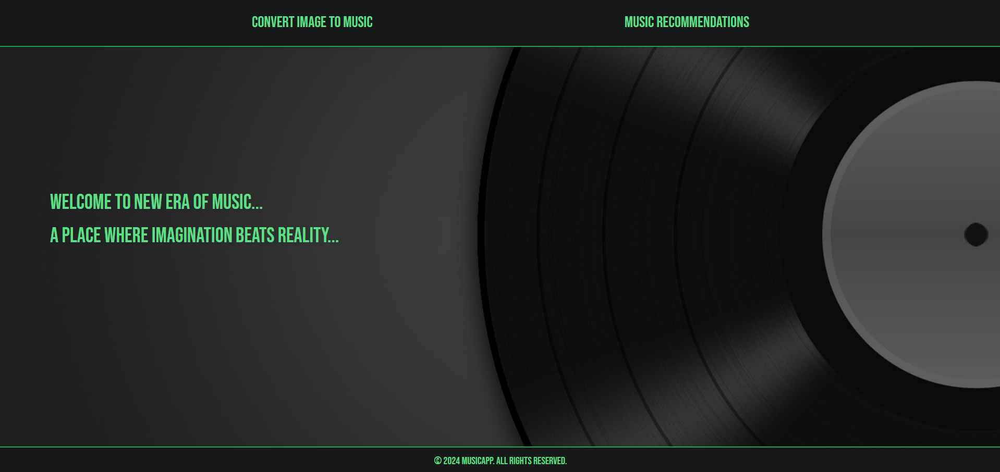
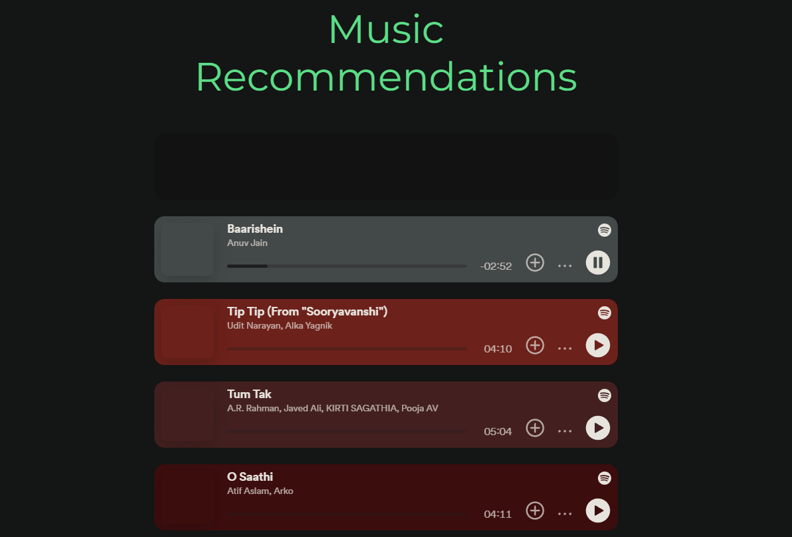

# MusicGenAI

## Demonstration

https://github.com/CrypticOwl5503/MusicGenAI/assets/92156713/4e15427a-ded3-4e0a-865e-492e87f9b61b


## Screenshots

### Homepage



### Recommendations



## Results

### Image to Audio Generation

#### Input


#### Result

[Listen to the audio](assets/peace.wav)

#### Input


#### Result

[Listen to the audio](assets/anime.wav)

### Image to Song Recommendation

#### Input


#### Result

Badal Pe Paon Hain by Hema Sardesai

<audio controls>
  <source src="assets/cloud.mp3" type="audio/mp3">
  Your browser does not support the audio element.
</audio>

#### Input


#### Result

All I Want For Christmas Is You

<audio controls>
  <source src="assets/christmas.mp3" type="audio/mp3">
  Your browser does not support the audio element.
</audio>

## How to Run

After unzipping the folder, follow these steps:

1. **Create and activate a virtual environment:**
   - First, install `virtualenv`:
     ```
     pip install virtualenv
     ```
   - Then, create a virtual environment:
     ```
     python -m venv myenv
     ```
   - Activate the virtual environment:
     - On Windows:
       ```
       .\myenv\Scripts\activate
       ```
     - On macOS and Linux:
       ```
       source myenv/bin/activate
       ```

2. **Navigate to your project directory in the command line and install dependencies:**

pip install -r requirements.txt


3. **Ensure the database is set up correctly:**

python manage.py migrate


4. **Download the data files from [Google Drive](https://drive.google.com/drive/folders/1k3eUSBngBh0PYAet40iKtCOG2Fdy5PA2?usp=sharing):**
- Choose either the Hindi or English dataset.
- Paste the `.obj` files in the data folder of your project.

5. **Start the server:**

python manage.py runserver


## Dataset Information

### IMAGE TO MUSIC RECOMMENDATION

The dataset consists of scraped song lyrics from Genius API (Miller, 2020) and song features from Spotify API (Lamere, 2022). It is based on the Wasabi dataset (Michael Fell, 2020), filtered to include only songs with Spotify ID from artists in the top 100 billboards since 1958, resulting in a corpus of 100,000 songs.

#### Dataset Cleaning

The dataset was filtered by artist popularity and includes attributes like danceability, energy, acousticness, and valence, ensuring a good distribution for modeling.

### IMAGE TO MUSIC GENERATION (MusicGenAI)

#### Training Dataset

We trained on 20K hours of licensed music, including 10K high-quality tracks and data from ShutterStock and Pond5.

#### Evaluation Dataset

For evaluation, we used the MusicCaps benchmark (Agostinelli et al., 2023) and in-domain held-out evaluation sets.

## Information Retrieval Model

### IMAGE TO MUSIC RECOMMENDATION

#### Feature Engineering & Embedding Generation

Using a pre-trained RoBERTa model (Yinhan Liu, 2019) via Sentence Transformer, lyrics embeddings were generated. Clustering was performed using MiniBatchKmeans based on these embeddings.

#### Semantic Similarity

A K-nearest neighbor model (KNN) was used to retrieve songs based on embeddings similarity, using cosine distance as the metric.

#### Results Ranking

Ranked results include compositional similarity scores and average similarity from lyrics lines to user query pairs.

### IMAGE TO MUSIC GENERATION (MusicGenAI)

#### Image-Text Generation

We used BLIP model for image-to-text generation, effectively utilizing noisy web data.

#### Model Architecture

A visual transformer was employed as the image encoder, with multimodal mixture of encoder-decoder (MED) for unified understanding and generation.

#### Image-Text Retrieval

Evaluated BLIP on COCO and Flickr30K datasets for both image-to-text and text-to-image retrieval.

#### Text-to-Audio Generation

Using an autoregressive transformer-based decoder conditioned on text or melody representation, employing EnCodec audio tokenizer and RVQ for compression.

#### Model Conditioning

- **Text Conditioning**: Utilized T5 text encoder and joint text-audio representation for better-quality generations.
- **Melody Conditioning**: Experimented with conditioning on melodic structure using chromagram and text description.

#### Model & Hyperparameters

- **Audio Tokenization Model**: Used a non-causal EnCodec model with RVQ.
- **Transformers Model**: Trained at different sizes with Flash attention for efficiency.
- **Text Pre-Processing**: Applied text normalization for musical datasets.

## Resources

- Lamere, P. (2022). Spotipy. From Read the Docs: Spotipy.
- Markelle Kelly, K. M. (2021). An Exploration of BERT for Song Classification and. From kaimalloy: BERT.
- Michael Fell, E. C. (2020). Cornell University. From Arxiv: Arxiv.
- Miller, J. W. (2020). lyrics genius. From Read the Docs: lyricsgenius.
- Reimers, N. (2022). Sbert.net. From Sentence-Transformer: Sentence Transformer.
- Yinhan Liu, M. O. (2019). RoBERTa: A Robustly Optimized BERT Pretraining Approach. From Arxiv: Robust BERT.
- Briggs, J. (2021). NLP similarity metrics | towards data science. Similarity Metrics in NLP, from Similarity Metrics.

---

This `README.md` file provides an overview of how to set up and run both the Image to Music Recommendation and Image to Music Generation (MusicGenAI) components of the project, along with details about datasets, models, and resources used.


